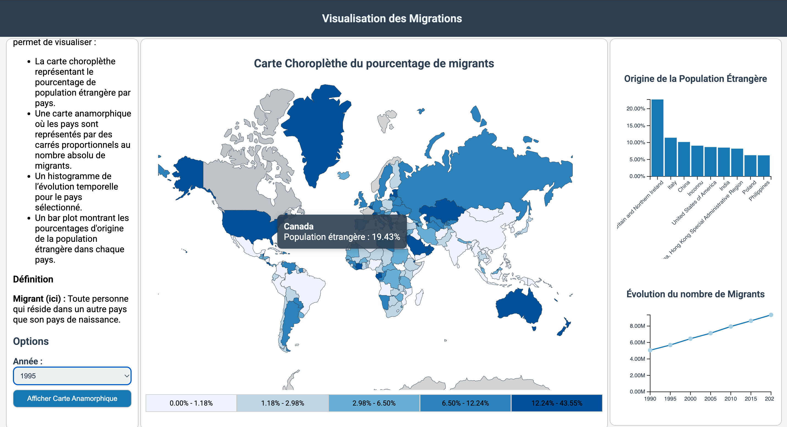
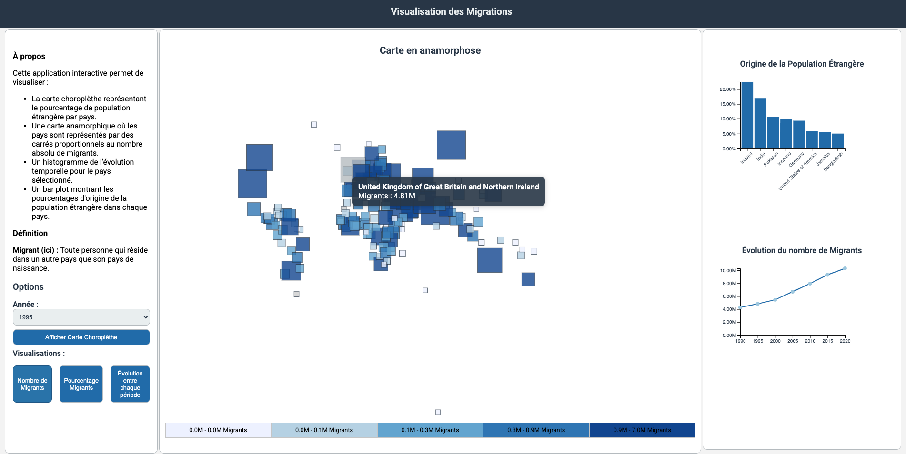
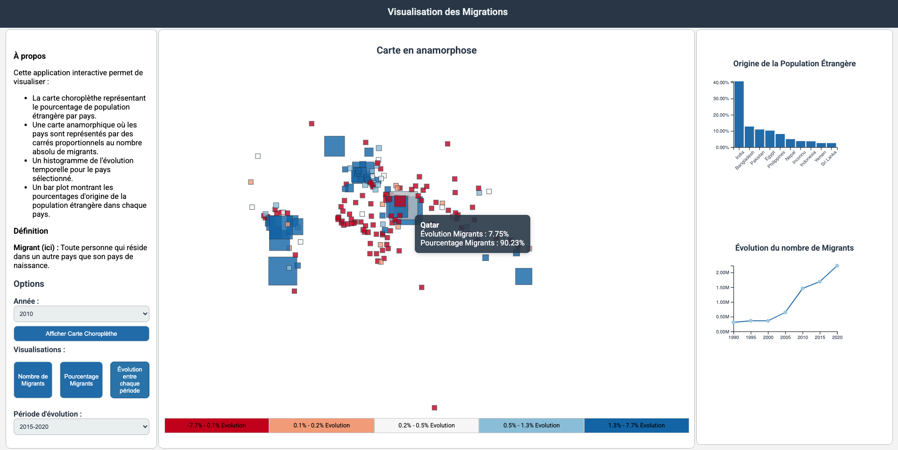

# README - Visualisation des Données Migratoires

## Description du Projet

Ce projet permet de visualiser des données de migration internationale à travers des cartes interactives et des graphiques dynamiques. Les utilisateurs peuvent basculer entre différents modes d'affichage, y compris une carte choroplèthe montrant les pourcentages de population étrangère et une carte anamorphique illustrant les flux migratoires à travers le temps et les pays. Le projet utilise **D3.js** pour l'animation, la gestion des cartes, des graphiques et des interactions avec l'utilisateur.

---

## Fonctionnalités

### Cartes
1. **Carte Choroplèthe** :
   - Affiche une carte de la population étrangère par pays pour l'année sélectionnée.
   - Utilise une échelle de couleur pour visualiser les pourcentages de migrants.
   - L'utilisateur peut sélectionner une année à l'aide d'un menu déroulant.

    

2. **Carte Anamorphique** :
   - Affiche une carte alternative où les pays sont redimensionnés selon le nombre de migrants (en mode "absolute") ou le pourcentage de migrants (en mode "percentage").
   - Permet de visualiser les changements de population migrante au fil du temps en mode "evolution".
   - Basculer entre les modes "absolute", "percentage" et "evolution" via des boutons de contrôle.

    
   

---

### Graphiques
1. **Graphique à Barres (Bar Plot)** :
   - Affiche les flux migratoires pour un pays sélectionné, avec des barres représentant les pays d'origine ou de destination.
   - Permet de visualiser les flux entrants ou sortants pour une année donnée.
  

2. **Graphique d'Évolution (Evolution Plot)** :
   - Affiche l'évolution des migrants (en millions) pour un pays au fil du temps, en utilisant une ligne avec des points pour chaque année.
   - Permet de visualiser les tendances migratoires entre 1990 et 2020.

---

## Interactivité

- **Carte Choroplèthe** :  
  Les utilisateurs peuvent survoler les pays pour voir des informations détaillées sur la population migrante, ou cliquer pour sélectionner un pays. L'année peut être modifiée via un sélecteur d'année.
  
- **Carte Anamorphique** :  
  Permet de basculer entre trois modes :  
  - **"absolute"** : Affiche les migrants en termes absolus.  
  - **"percentage"** : Affiche les migrants en pourcentage de la population.  
  - **"evolution"** : Montre l'évolution des migrants au fil du temps.  
  Les utilisateurs peuvent aussi choisir des périodes spécifiques pour observer les évolutions.

- **Graphiques** :  
  Les utilisateurs peuvent cliquer sur un pays dans les cartes pour afficher les données migratoires dans un graphique à barres, représentant les flux entrants et sortants. Les graphiques d'évolution montrent l'évolution des flux migratoires dans le temps.

-  **Interactivités supplémentaires** : 
  - Des informations aparaissent par survol sur les graphiques et les cartes
  - Les clics sur des pays (ou carrés) affichent les graphiques associés.

---

## Animation et D3.js

Le projet utilise **D3.js** pour plusieurs aspects :
- **Cartes interactives** : Animation de la transition des cartes lors du changement de données (changement de pays, changement d'année).
- **Graphiques dynamiques** : Les barres et lignes des graphiques sont animées pour rendre la visualisation plus fluide et attrayante.
- **Colorbars** : La colorbar des cartes et graphiques est mise à jour dynamiquement pour refléter les changements dans les données (ex : pourcentage de migrants).

---

## Fonctionnement Global

1. **Chargement des Données** :  
   Les données de migration sont chargées depuis des fichiers JSON et CSV. Ces données sont ensuite traitées et mappées pour chaque pays à l'aide de D3.js.

2. **Affichage des Cartes et Graphiques** :  
   Le code utilise D3.js pour générer les cartes choroplèthes et anamorphiques, ainsi que les graphiques à barres et d'évolution. Ces éléments sont mis à jour dynamiquement en fonction des interactions de l'utilisateur.

3. **Contrôles et Sélections** :  
   L'utilisateur peut interagir avec les éléments à l'écran, tels que les boutons pour changer de mode ou les sélecteurs pour choisir une année. Ces interactions entraînent des mises à jour visuelles et des calculs en temps réel.

---

## Contenu du fichier `world-migration.zip`

- **Les fichiers de données** :  
  - `world.geojson` : Données géographiques pour la carte du monde.
  - `final_migration_data.json` : Données de migration par pays.
  - `correspondances.csv` : Correspondances entre les codes pays ISO et M49.
  - `pop_tot.json` : Données de population totale par pays.

- **Les scripts** :
  - **`index.html`** : Contient la structure HTML de la page, y compris les conteneurs pour les cartes, graphiques et contrôles d'interaction.
  - **`script.js`** : Gère l'application principale, les interactions avec l'utilisateur et les visualisations (cartes choroplèthes et anamorphiques, graphiques). Ce script utilise D3.js pour manipuler et animer les éléments de la page.
  - **`styles.css`** : Définit la disposition et le style de la page, y compris la mise en page des conteneurs, les animations et les couleurs des cartes et graphiques.

## Données

  - Les données de migration sont issues de [Migration Data Portal](https://www.migrationdataportal.org/)
  - Les données de correspondances du [Reposit](https://github.com/lukes/ISO-3166-Countries-with-Regional-Codes/blob/master/all/all.csv/)
  - les données de population totale de [World Bank](https://data.worldbank.org/indicator/SP.POP.TOTL/)

---

